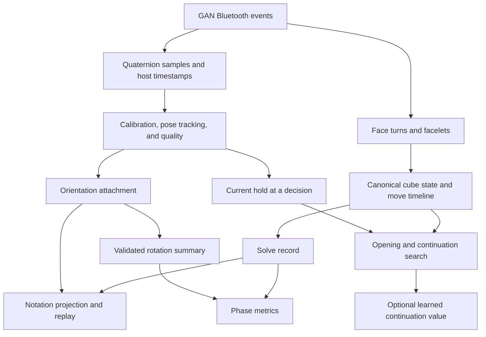

# GAN i4 orientation and deeper planning: phased implementation plan

Status: proposed implementation plan, 9 September 2026. Hardware behavior of a gyro-equipped
GAN i4 has not yet been measured. Estimates below are engineering effort, not delivery commitments.

Phase 0 software preparation is implemented: opt-in capture, stream diagnostics, test markers,
JSON export, and a synthetic benchmark. See [the hardware testing guide](GYRO_TESTING.md).
The first recording identifies the user's cube as a **GAN i Carry 4**, with no gyro stream,
rather than the gyro-equipped i4 assumed below. See [the Phase 0 results](GYRO_RESULTS.md).
Positive gyro validation requires a compatible device; deeper search/model work can proceed
independently. The orientation design below remains a roadmap for gyro-capable hardware.

## Objective and starting point

Use the cube's physical orientation to make reconstructions easier to read, explain rotations
more accurately, and help the planner choose solutions that lead naturally into later pairs.
Develop stronger continuation prediction on top of verified cube search.

The working tree already contains bounded x-cross, cross + 1, cross + 2, and two-pair F2L
lookahead. That is the baseline to evaluate and extend; a new learned continuation model has
not been trained. The search and model design is described in
[ml/LOOKAHEAD.md](ml/LOOKAHEAD.md). This plan adds the orientation pipeline, its integration
with that search, and a separately gated model-development phase.

The intended release order is:

1. Prove that usable orientation samples arrive from this GAN i4.
2. Capture and reconstruct orientation without changing the underlying solve.
3. Release readable notation and live/replay orientation.
4. Enable rotation scoring only when its measurements are validated.
5. Use the current hold to improve opening and pair choices; evaluate a new continuation model.

Readable replay, scoring, and planning have separate release gates. A useful replay feature
must not depend on proving that every physical rotation can be counted accurately.

## Evidence and hardware constraints

| Finding | Implication for implementation |
|---|---|
| GAN advertises gyro support on the i4 and approximately 30 hours in gyro-on Performance mode versus 200 hours in gyro-off Endurance mode. Endurance also disables recording. | Verify the cube's mode before diagnosing an absent stream. Battery figures are manufacturer claims, not app measurements. [GAN product page](https://www.gancube.com/products/gan-i4-leap) |
| acubemy reports approximately 10 orientation updates per second and accumulating drift on its tested i4. | Treat this as a useful starting hypothesis. Measure this unit and firmware; do not promise exact rotation timing or assume the same behavior across all variants. [Firsthand i4 testing](https://acubemy.com/blog/gan-i4-review) |
| Installed `gan-web-bluetooth` 3.0.2 decodes quaternion events in its Gen2 and Gen4 handlers. Its Gen4 hardware flag recognizes only `GAN12uiM`. | `gyroSupported: false` can conflict with a usable stream. Detect received samples separately from the advertised flag; verify the i4's actual protocol before changing support declarations. [Protocol source](https://github.com/afedotov/gan-web-bluetooth/blob/main/src/gan-cube-protocol.ts) |
| The installed library supplies host timestamps for gyro events, without a device sample timestamp. Its optional angular velocity has coarse encoded values without documented physical units. | Keep timing uncertainty explicit. Do not treat arrival times as precise sample times or integrate velocity as radians per second. |

Orientation identifies how the sensor/core moves. It does not identify hand placement, eye
position, or the solver's intent. Wide and slice turns can involve core motion that resembles
a whole-cube rotation. Fast movements between samples can also be ambiguous. Geometric
visibility and ease of transition remain estimates, even with good orientation data.

An external reference is needed to establish the initial hold. A solved piece state alone
does not reveal which way the cube faces in the room. Recalibration can restore a reference;
software cannot guarantee recovery of an unobserved rotation or arbitrary accumulated drift.

## Architecture and invariants

The implementation must preserve these rules:

- Face-turn events and facelet reconciliation remain authoritative for piece state. Gyro
  samples never enter move serial tracking, scramble matching, or the cube-state tracker.
- Store canonical notation separately from the notation displayed in a changing frame.
  Inserting `x`, `y`, or `z` without renaming subsequent turns changes the algorithm's meaning.
- Keep canonical move indices stable. Phase boundaries, timestamps, highlights, and branch
  points already depend on those indices.
- Rotations do not start or stop the solve timer and do not increase face-turn count or TPS.
  Inspection orientation and a short capture tail must not extend solve duration.
- Missing or unreliable orientation means unknown rotation count. It never means zero.
  Eligibility belongs to the recorded solve, not whichever cube is connected during review.
- A plausible frame for display is weaker evidence than an accurately counted physical action.
  Maintain separate quality decisions for display, timing, rotation counts, and planner input.
- Measured orientation applies only to the actual recorded trajectory. After a hypothetical
  branch diverges, its orientation is predicted from that branch's own moves and setup choices.
- Existing B3 feature definitions and weights remain compatible. New features require a new
  model schema and export.

### Ownership and data contracts

Create a pure `packages/orientation` package, depending only on the engine. First move the
discrete frame utilities from [planner/orientation.ts](packages/planner/src/orientation.ts)
without changing behavior, retaining planner re-exports. Add quaternion math, calibration,
pose tracking, and notation projection there. Transport should not acquire a dependency on
the planner; metrics should receive neutral summaries rather than Bluetooth objects.

Proposed persisted contracts are versioned, plain JSON:

| Record | Required information |
|---|---|
| Capture metadata | Schema version, adapter/protocol version, reported hardware and firmware, reported support, observed stream status, capture epochs, known mode or `unknown` |
| Orientation sample | Capture epoch, received-event ordinal, host-time offset, quaternion, optional unscaled velocity; device sample time remains absent unless actually supplied |
| Calibration | Identifier, epoch, effective time offset, reference quaternion, chosen reference face orientation, algorithm version |
| Pose interval | Start/end offsets, frame identifier, angular residual, sample support, accepted/uncertain status and reasons |
| Rotation estimate | Start/end uncertainty intervals, before/after frames, candidate notation, action grouping, count eligibility and reasons |
| Solve summary | Stream coverage and gaps, calibration references, frame coverage at move boundaries, count or `null`, provenance and scoring eligibility |
| Display token | Notation, originating canonical move index or move boundary, display timestamp/interval, measured/inferred/synthetic provenance |

Use a consistent solve-relative host-time basis for new orientation data, including negative
offsets for inspection. Store final retimed move offsets alongside the attachment so a replay
can join both streams after reload. Existing `solution` and `moveTimestamps` remain compatible.
If the time basis resets, start a new epoch and mark any unresolved alignment.

Keep advertised capability, samples arriving, calibration, and quality as separate fields.
A stream timeout alone cannot distinguish a sleeping cube, disabled mode, or unsupported
hardware. A compact user-facing status can be derived from these fields.

## Phases

### Phase 0 — Validate the GAN i4 and establish baselines

**Effort:** 1–2 days, plus access to the physical cube. **Dependency:** none.

Build a diagnostic recorder and panel in the connection/self-test area. It should expose
received gyro events without changing the solve, and export a reproducible diagnostic fixture.
Primary touchpoints: [gan.ts](packages/cube-link/src/gan.ts),
[CubeHarness.tsx](apps/web/components/CubeHarness.tsx), and the web self-test area.

Record hardware/firmware, negotiated protocol/service, library version, advertised gyro flag,
observed sample count, interval distribution, invalid quaternions, stream stalls, and concurrent
face turns. Omit the device MAC from exports by default. Record mode as unknown when it cannot
be verified. Use documented controls to change modes; do not invent BLE write commands.

Run a short scripted hardware session:

1. Hold still for 30–60 seconds, then several minutes, to measure jitter and reference drift.
2. Perform isolated `x`, `y`, `z`, inverse, and half rotations, with pauses between them.
3. Repeat at normal solving speed, including consecutive rotations and return-to-start motions.
4. Turn faces while maintaining a hold; include deliberate wide/slice executions and natural tilt.
5. Capture normal solves, reconnects, sleep/wake behavior, and each available operating mode.

Use synchronized video or an independently annotated script for physical ground truth. A
rendered cube that follows the same gyro stream is not independent validation. Also capture
the current app's move-delivery latency and planner median/tail latency as regression baselines.

**Deliverable:** a hardware findings document and small fixture corpus, with separate results
for stream availability, axis mapping, timing, and drift.

**Exit gate:** observed usable quaternion packets and a verified relationship between reported
pose and known rotations. If packets are missing, identify mode/protocol/library support first.
If only coarse pose is reliable, proceed with display experiments while leaving action counting
and scoring disabled. Synthetic tests can proceed without hardware, but do not satisfy this gate.

### Phase 1 — Capture and persist orientation independently

**Effort:** 2–3 days. **Dependency:** Phase 0 event/clock contract.

Add an optional orientation subscription to [CubeSource](packages/cube-link/src/source.ts)
and implement it in the GAN adapter. Keep manual and existing replay sources compatible.
Replace the adapter's current discarded `GYRO` path with validated, timestamped events.
Preserve the library's advertised hardware flag and separately report observed capability.

Extend the session recorder with a bounded orientation buffer beginning in inspection. Assign
capture epochs on reconnect/reset, subscribe and unsubscribe with source lifecycle, and finalize
orientation after a short bounded tail when needed. Show solve completion immediately; the tail
must neither delay the timer result nor absorb the next solve's samples.

Use an IndexedDB version 2 orientation store keyed by solve ID. Keep small quality summaries
on `SolveRecord`; load the full attachment only for detail/replay. Extend the shared MemoryStore
and IndexedDB contracts with attachment reads and atomic solve-plus-attachment writes. Deleting
a solve or clearing history must remove its attachment in the same transaction. Define export
and import behavior so attachments round-trip when a solve is exported.

If a combined save fails because the attachment cannot be stored, abort that transaction and
attempt a canonical-only save explicitly marked as missing orientation. Surface a save failure
if that also fails. Never leave a successful-looking summary pointing at a missing attachment.

Choose and document finite limits for inspection buffering, long solves, and attachment size
from Phase 0 measurements. Preserve canonical solve capture when a limit is reached; explicitly
mark orientation as truncated. Completed attachments retain raw samples so improved derivation
can run later without recapturing the solve.

Join gyro host times to the existing [move timeline](packages/cube-link/src/timeline.ts).
Do not add gyro samples to its device-to-host clock regression. Recompute move/pose associations
after the recorder's final move retiming. Do not extrapolate across disconnections or unknown
clock epochs.

**Validation:** adapter event fixtures; unsupported/manual sources; lifecycle cleanup; interleaved
face turns and gyro; version 1 database migration; missing attachments; transactional failures;
delete/clear; round-trip serialization; buffer limits; timer and move-count invariance.

**Exit gate:** recorded samples replay deterministically, old records still load, and canonical
records match capture with orientation disabled. Legacy smart-cube records have unknown rotations.

### Phase 2 — Calibrate and track stable cube orientations

**Effort:** 3–5 days. **Dependency:** Phases 0–1.

Implement quaternion normalization, finite/zero checks, sign continuity (`q` and `-q` represent
the same orientation), relative-reference transforms, and angular distance in the new pure
orientation package. Verify the library's sensor axes against engine/display conventions with
physical fixtures; do not assume multiplication order or signs from visual intuition.

Provide a short calibration flow: hold two specified center colors in the displayed orientation
and set the reference once stable. Calibration works on a scrambled cube and must not invoke
the existing reset-to-solved action. Keep calibration history so changing the reference does not
rewrite earlier measurements or count as a physical rotation.

Track the nearest of 24 discrete cube frames using angular acceptance limits, hysteresis, and
time-based dwell. Tune thresholds on the hardware fixtures rather than hardcoding an assumed
sample rate. Reject ambiguous boundary poses and stale samples. Ordinary wrist tilt should not
create alternating rotations. Provide continuous pose for animation separately from discrete
frames for notation.

Use a bounded-lag live tracker and an offline pass that can inspect samples on both sides of a
move. Keep accepted frames and rejected intervals inspectable. Reconnects and reference changes
invalidate affected intervals; resynchronizing piece state does not automatically calibrate pose.
Offer a reference reset between solves instead of claiming solved-state detection fixes drift.

Track observed movement intervals separately from their shortest `x/y/z` spelling. A change
between two endpoint frames does not establish whether the solver performed one half rotation,
two quarter rotations, or a longer path. Skipped intermediate samples must produce uncertainty,
not a fabricated action count.

**Validation:** all 24 frames; each signed quarter/half rotation; quaternion sign changes; noise;
tilted holds; threshold crossings; missing samples; reference drift; calibration during capture;
fast multi-axis movements and core motion during wide/slice turns.

**Exit gate:** stable holds and simple scripted rotations are classified consistently, and
ambiguous movements become unknown rather than false certainty. Quantify coverage as well as
accuracy before tuning further.

### Phase 3 — Produce readable, state-equivalent reconstructions

**Effort:** 3–4 days. **Dependency:** Phase 2.

Build a projection from canonical face turns plus accepted orientation intervals into readable
notation. At each supported frame change, emit a display rotation and rename subsequent face
turns into that frame. Reuse the engine-derived frame mappings rather than a second handwritten
face mapping table.

Preserve a token-to-canonical-index map so phase highlights, timestamps, navigation, explanations,
and alternate branches still refer to the original solve. Attach uncertainty where a turn occurs
during a poorly resolved rotation. Final move retiming must trigger projection regeneration.

For unresolved intervals, retain a stable readable frame and label orientation as inferred or
unavailable. Any frame rebase used to resume presentation is a display operation, never an
observed rotation for scoring. Do not manufacture wide/slice notation merely because core motion
and outer turns could be expressed that way.

Validate equivalence at every corresponding move boundary: undo the display frame and compare
the entire reconstructed state with the canonical state. A final solved-state comparison is
insufficient because many incorrect intermediate reconstructions still end solved.

Primary integrations: [SolveDetail.tsx](apps/web/components/SolveDetail.tsx), planner frame
utilities, and [segmented.ts](packages/session/src/segmented.ts). Keep segmentation based on
canonical moves and use explicit maps when rendering its spans.

**Validation:** property tests over scrambled states and all frames; rotations immediately
before/after turns; ambiguous ordering; mid-solve reference changes; phase boundaries; replay
seeks; hypothetical branches; old smart-cube and typed manual reconstructions.

**Exit gate:** 100% state equivalence on automated fixtures, with no canonical index or timing
regressions. Hardware frame accuracy remains a separate measurement.

### Phase 4 — Add live orientation and useful replay controls

**Effort:** 2–3 days. **Dependency:** Phases 2–3.

Extend [TwistyPlayer.tsx](apps/web/components/TwistyPlayer.tsx) with an independent pose control.
First verify how the installed rendering library supports this. The current `setState` resets
animation history and must not be called for every quaternion. If an independent continuous
pose cannot be supported cleanly, release discrete replay orientation first.

Interpolate accepted continuous pose for rendering using an animation loop; do not drive a full
React render or planner search on every sensor sample. Interpolation smooths presentation and
does not increase sensor resolution. After a long gap, hold the view until pose can be established
again rather than animating an invented path.

Add a choice between following the recorded hold and using a stable viewing angle. Notation and
the cube must agree in either mode. Replace the connection panel's `gyro yes/no/?` with useful
statuses such as receiving, calibration needed, or no orientation data arriving. Keep technical
packet details in diagnostics.

In solve review, show whether orientation is recorded or inferred. Carry measured pose through
the actual prefix of an alternate solution, then use that solution's predicted frame after the
branch point. Preserve seek, speed changes, scrubbing, and phase navigation.

**Validation:** fresh/reconnected sources, ordinary tilted holds, repeated solves, end-of-solve
capture tails, old records, gaps, tab background/resume, rapid seeking, and branch playback.
Compare move-delivery latency and memory with Phase 0 baselines under concurrent planning.

**Exit gate / first user-facing release:** readable replay and optional live pose work on the
validated i4 profile, with clear fallbacks. This milestone does not require rotation scoring.

### Phase 5 — Validate rotation metrics, then enable scoring

**Effort:** 3–5 days of implementation, plus labeled capture/validation time.
**Dependency:** Phases 0–4 and a sufficiently representative hardware dataset.

Define counting semantics before fitting thresholds: an observed physical rotation episode,
a notation token, and quarter-turn-equivalent rotation magnitude are different quantities.
For example, `y2` is one token but can pass through two discrete frame changes. Compare the
chosen definition with the corpus reconstructions used for percentiles. If they cannot be made
comparable, show a separate personal rotation metric without adding it to the composite score.

Replace source-only checks such as `observesRotations(source)` with per-record evidence and
metric-specific eligibility. Audit every `scoreSolve` caller, including both uses in solve detail.
Preserve explicit manual rotations without double counting a derived trace. Keep older smart
records and incomplete gyro captures excluded from rotation percentiles.

Provide per-solve and per-phase counts only where evidence supports them. Report partial
observations as partial, not an estimated full count by default. A movement spanning a phase
boundary may be unassigned. Approximate rotation intervals do not justify precise rotation
duration or recognition-time claims. Rotation overlaps already elapsed solve time; it must not
be added again to pauses or duration.

Start in shadow mode: calculate the new results and compare them with annotations while the
visible score remains unchanged. Split threshold-tuning clips from held-out evaluation clips.
Cover multiple sessions, grips, speeds, and challenging wide/slice cases. Broader hardware support
requires additional device/firmware validation rather than extrapolation from this one cube.

Proposed initial acceptance targets, to review after Phase 0:

| Measure | Initial gate |
|---|---|
| Reconstruction state equivalence | 100% on automated cases |
| Accepted frame accuracy at evaluable move boundaries | At least 98%, with at least 95% move-boundary coverage |
| Counted rotation precision / recall | At least 99% / 95% on held-out labeled actions |
| Whole-solve count agreement | Within one action on at least 95% of held-out solves |
| Still-hold and ordinary face-turn controls | No false counted rotations in the controlled fixture suite |
| Missing data, legacy records, and uncalibrated captures | Always excluded from rotation scoring |

Collect an initial qualification set of roughly 100 solves and 500 annotated rotation actions,
plus controlled nonrotation clips. These are starting collection targets, not proof of general
accuracy. Report denominators, rejected intervals, per-session results, and uncertainty bounds;
do not obtain apparent accuracy by rejecting nearly all difficult solves. Actual timing error
must be measured against independent ground truth, including Bluetooth arrival uncertainty.

**Exit gate:** held-out targets and corpus comparability pass for a documented hardware profile.
Otherwise retain replay and optional partial rotation summaries with scoring disabled. Store
derivation/scoring versions so later updates do not silently rewrite historical interpretation.

### Phase 6 — Connect physical hold to deeper search

**Effort:** 2–4 days for initial integration and benchmarking. **Dependency:** Phases 2–4;
does not require Phase 5's percentile-scoring gate.

Pass optional accepted physical hold, its timestamp, and its quality into planner requests.
Keep it separate from `CubeState`: a Bluetooth cube's logical center frame does not change
merely because the user rotates it. Capture the hold at the relevant decision boundary and
discard stale worker results when state or requested hold changes.

Extend the existing search in [openings.ts](packages/planner/src/openings.ts),
[lookahead.ts](packages/planner/src/lookahead.ts), and [plan.ts](packages/planner/src/plan.ts):

1. Compare cross, x-cross, cross + 1, and cross + 2 candidates from the actual starting hold,
   accounting for the setup needed to reach each candidate's execution frame.
2. Carry an execution frame through pair continuations, rather than independently choosing
   the most comfortable frame for each insertion without paying for transitions.
3. Retain diverse resulting piece states and frames. Sequences solving the same pair can set
   up different later pairs, so deduplication must not collapse them solely by solved slot.
4. Initially keep verified continuation turns as the primary objective and use explicit grip
   costs as tie-breakers. Later fit an execution-cost objective on reliable timing data; do not
   add arbitrary move counts, radians, model logits, and milliseconds together.
5. Benchmark whether wider beams, additional near-optimal insertions, or deeper horizons improve
   results under equal browser budgets. Preserve two-pair interactive defaults until evidence
   supports a change; use larger offline searches as comparison bounds.

Add replayable examples in which a slightly longer cross creates a strong first pair, a joint
opening solves two pairs, and a longer immediate insertion produces a cheaper next insertion.
Include cases where a deliberate rotation helps; fewer rotations alone is not the objective.
For equal targets, display immediate turns, continuation turns, and setup choices so the user
can see why the recommendation changes. Do not compare incomplete horizons as equal completions.

Primary UI touchpoints: planner worker/messages, `usePlanner`, `PlannerPanel`, `DiffPanel`, and
solve detail's alternate playback. Update advice at decision points or debounced stable hold
changes, not every incoming orientation sample. Unknown hold uses the existing inferred-frame
behavior with appropriate provenance.

**Validation:** all recommended sequences replay correctly and preserve required solved pieces
at step endpoints; frame transitions are charged consistently; no future measured pose leaks
into hypothetical alternatives; bounded search remains cancellable; compare candidate coverage,
cross + 1/+2 turns, F2L continuation cost, and browser tail latency with the baseline.

**Exit gate:** grip input produces explainable valid changes on targeted cases, with acceptable
latency and no degradation hidden by unequal search budgets. Claims of faster human execution
wait for timed user comparisons.

### Phase 7 — Train and evaluate a continuation model

**Effort:** an additional 2–4 engineering weeks for an initial experiment, with data collection
and further research potentially extending this. **Dependency:** search baseline and evaluator;
can begin without gyro. Measured orientation features depend on validated capture.

Use the engine as the exact transition model. Learn which candidate sequences are promising
and how difficult the remaining position is, following [the model design](ml/LOOKAHEAD.md).
This phase has four concrete deliverables:

**A. A versioned transition dataset.** Store before state, candidate moves, after state, solved
slots, execution frame, continuation horizon/cost, search budget/truncation, and source solve.
Extend decision extraction to x-cross and simultaneous pair insertions, grouping actual
transitions rather than inventing a sequence of separate human decisions. Record whether hold
is measured, inferred, or unavailable. Recognition and gaze are not gyro labels.

**B. Explicit supervision.** Human reconstructions label chosen actions; bounded search supplies
verified alternative sequences and upper bounds on remaining turns. Unchosen actions are not
automatically mistakes, and a truncated search is not a cheap continuation. Replan each changed
branch from its own resulting state. Timed execution labels require reliable timing and a
separate definition of the prediction target.

**C. A policy/value experiment.** Begin with a small transition scorer or value estimator that
can rank beam expansions or estimate cost beyond the explored horizon. Export a new feature
schema and model version with shared training/browser extraction. Preserve the current B3 path
as a baseline and fallback. Include geometric accessibility, continuation options, frame setup,
and missingness/provenance where appropriate; do not label them observed attention.

**D. A held-out evaluation report.** Compare immediate move count, B3 imitation, bounded lookahead,
and lookahead plus the new model under equal search budgets. Split by solver/source solve and
keep all branches and symmetry variants together. Deduplicate equivalent positions across splits
where feasible. Measure candidate recall, opening/continuation quality, larger-search regret,
human-choice calibration, latency, and timed execution only where suitable observations exist.
Run an ablation with orientation removed to establish what gyro actually adds.

**Exit gate:** adopt the model only if it improves continuation quality or delivers similar
quality with less search on held-out data. Better first-pair imitation alone does not establish
better planning. If this experiment fails, retain the verified search and grip integration.

### Phase 8 — Qualify and roll out independently

**Effort:** 2–3 days plus normal user testing. **Dependency:** the relevant preceding feature gates;
the first replay release need not wait for Phase 7.

Use separate switches for orientation capture, following pose, measured notation, rotation
scoring, planner hold input, and the new model. Start with an opt-in diagnostic workflow, then
release replay on validated profiles, then independently enable scoring and planner improvements.

Run the existing typecheck, test suite, and web production build, plus targeted orientation,
storage migration, and browser integration checks. Exercise smart cubes without gyro, manual
entry, existing replay, old databases, offline review, reconnects, and clock/stream gaps. Read
the web app's local development instructions before implementation there.

Set performance budgets from Phase 0 measurements. An initial target is no more than 10% added
p95 move-handling latency on the same device/workload, subject to a minimum measurement noise
floor. Also report absolute latency, attachment sizes, long-session memory, and planner tail
latency. Capture must remain bounded, and gyro delivery must not schedule unbounded UI/search work.

Keep raw captures and versioned derivations separable so algorithms can be reevaluated lazily.
Rollback of display, scoring, or model logic must not delete canonical solves or require a
reverse database migration. Preserve readable fallback behavior when an attachment is absent.

**Exit gate:** the feature being released passes its own accuracy, compatibility, and performance
checks. Document supported hardware/firmware evidence and remaining limitations in the app docs.

## Dependencies, milestones, and effort

| Milestone | Included work | Approximate cumulative engineering effort |
|---|---|---|
| Hardware decision | Phase 0 | 1–2 days |
| Reproducible orientation capture | Phases 0–1 | 3–5 days |
| Readable replay MVP | Phases 0–4 | 11–17 days |
| Qualified gyro integration, metrics, and grip-aware search | Phases 0–6 and release work in Phase 8 | 18–29 days |
| Initial learned continuation experiment | Phase 7 in addition | 10–20 days |

These ranges assume the current library can expose the i4 stream and the existing renderer can
support the required pose controls. They exclude waiting for hardware recordings, annotation,
an upstream protocol fix, or enough timed solves to validate an execution model. The full track
is approximately 6–10 engineering weeks; calendar time can be longer.

The critical early path is hardware evidence → reliable capture → calibration → correct
notation. Dataset/search evaluation can run alongside orientation work. Rotation scoring is
an independent gate and should not hold up a successful replay release.

## Regression and failure matrix

| Scenario | Required outcome |
|---|---|
| Hardware says gyro unsupported but valid packets arrive | Show the evidence accurately; process valid packets under the observed profile |
| Gyro disabled, asleep, missing, or uncalibrated | Face turns work; orientation unavailable; no rotation percentile |
| Still cube, natural tilt, or quaternion sign flip | No spurious counted rotations |
| Rapid half/full rotation or multi-axis motion between samples | Preserve ambiguity; do not invent an exact action history |
| Wide/slice execution moves the core | Do not equate every pose change with an intentional whole-cube rotation |
| Rotation and face turn are too close to order reliably | Mark association uncertainty and use a state-equivalent display fallback |
| BLE gap, reconnect, background tab, or clock discontinuity | Separate epochs/gaps; never interpolate a supposedly measured trajectory through missing data |
| Calibration changes during a solve | Preserve prior reference history; calibration itself is not a counted rotation |
| Gyro arrives during inspection or after the last turn | Preserve first-to-last-turn duration and face-turn TPS |
| Storage limit or attachment write failure | Retain an explicitly degraded canonical solve; no silent orphaned/inconsistent attachment state |
| Legacy smart-cube solve | Rotations unknown, original replay and score semantics preserved |
| Typed manual `x/y/z` | Preserve explicit rotation semantics and avoid double counting |
| Hypothetical pair/order branch | Use actual prefix pose only; derive the future from the proposed branch |
| Search budget expires | Return verified best-found paths and incompleteness; never treat missing continuation as zero cost |

## Recommended first implementation change

Implement Phase 0 as a small diagnostic change: surface gyro events, compare reported support
with actual packets, record both event streams, and export a fixture for known rotations.
The first concrete acceptance result is a verified trace from this GAN i4 and a written decision
about which uses its signal supports. That evidence sets the thresholds and scope of the later
phases.
